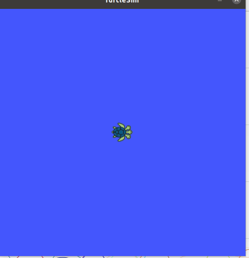

# ROS Tutorial Turtlesim

## Introduction

Welcome to the ROS [Turtlesim](http://wiki.ros.org/turtlesim) tutorial. 

With this tutorial we dive in the basics of the ROS syntax. 

The syntax will be applied to very simple robot ([turtlesim](http://wiki.ros.org/turtlesim)) that runs in 2D environment.

For the easy use we will be using a docker container. So this tutorial can be execute on **Windows** or **Linux OS**. 
Possibly also MacOS. ( but that isn't tested/documented )

## Objectives

* Learn the basics of the ROS syntax by doing.
* Controlling the Turtlesim by terminal and python script.
* Implemented the basisc of 2D navigation.

## Requirements
* PC with Windows OS (admin rights needed)
* Or PC with Ubuntu OS (sudo rights needed)
* Docker is needed (See installation)
* **No GPU needed!!**

## Credits

This tutorial is create during the research project [ROSDRIVEN](https://www.rosdriven.dev) 
at [VIVES University of Applied Sciences](https://www.vives.be/en/vives-international) department [Technology](https://www.vives.be/en/research/centre-expertise-smart-technologies).

