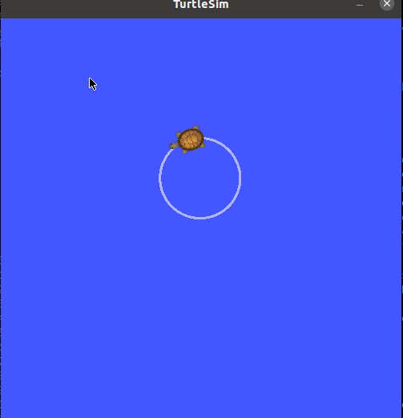

# Controlling the Turtlesim

To control/move the Turtlesim we make use of the rostopic cmd_vel. 
This is standard rostopic that used in practically every robot that use ROS. 
With this command we can command the linear and angular speed of the robot.


#### Get info turtlesim

As reminder we first check the info off the turtlesim node.

```shell
rosnode info /turtlesim 
```

Output:

```shell
Node [/turtlesim]
Publications: 
 * /rosout [rosgraph_msgs/Log]
 * /turtle1/color_sensor [turtlesim/Color]
 * /turtle1/pose [turtlesim/Pose]

Subscriptions: 
 * /turtle1/cmd_vel [unknown type]

Services: 
 * /clear
 * /kill
 * /reset
 * /spawn
 * /turtle1/set_pen
 * /turtle1/teleport_absolute
 * /turtle1/teleport_relative
 * /turtlesim/get_loggers
 * /turtlesim/set_logger_level


contacting node http://127.0.0.1:33755/ ...
Pid: 252
Connections:
 * topic: /rosout
    * to: /rosout
    * direction: outbound (47461 - 127.0.0.1:38932) [16]
    * transport: TCPROS
```


The turtlesim node is subscribed to the cmd_vel topic. 
To actually send this topic `rostopic pub` can be used, see later on.

 
#### Get info rostopic cmd_vel

To get the message type of the rostopic `/turtle1/cmd_vel` we use the argument `type` below.


```shell
rostopic type /turtle1/cmd_vel 
```

**Output**

```shell
geometry_msgs/Twist
```

To get the specific info of the rosmsg we can extend the command with `rosmsg show`

```shell
rostopic type /turtle1/cmd_vel | rosmsg show 
```

**Output**

```shell
geometry_msgs/Vector3 linear
  float64 x
  float64 y
  float64 z
geometry_msgs/Vector3 angular
  float64 x
  float64 y
  float64 z

```


The requirement is for two vectors with 3 elements each. The message type is geometry_msgs/Twist . 

To get a list of messages for ROS of geometry_msgs 

[http://wiki.ros.org/geometry_msgs ](http://wiki.ros.org/geometry_msgs)

This displays a verbose list of topics to publish to and subscribe to and their type: 

```bash
rostopic list -v 
```

**Output**

```shell
Published topics:
 * /turtle1/color_sensor [turtlesim/Color] 1 publisher
 * /rosout [rosgraph_msgs/Log] 1 publisher
 * /rosout_agg [rosgraph_msgs/Log] 1 publisher
 * /turtle1/pose [turtlesim/Pose] 1 publisher

Subscribed topics:
 * /turtle1/cmd_vel [geometry_msgs/Twist] 1 subscriber
 * /rosout [rosgraph_msgs/Log] 1 subscriber
```

## Move the turtle

The following command will send a single message to turtlesim telling it to move with a linear velocity of 2.0, 
and an angular velocity of 1.8. It will move from its starting position along a circular trajectory for a distance and then stop. 

```bash 
rostopic pub -1 /turtle1/cmd_vel geometry_msgs/Twist -- '[2.0, 0.0, 0.0]' '[0.0, 0.0, 1.8]' 
``` 

* `-1`, `--once`:	publish one message and exit 
* `-r` RATE, --rate=RATE publishing rate (hz). For -f and stdin input, this **defaults to 10**.  

Otherwise it is not set. 

::: tip 
With tab completion it is easy to find the data formats
:::

```shell
rostopic (Tab) pub -1 /tur (Tab) cm (Tab) geo (Tab)  (Tab) (Tab) …..	
```

Output:

```shell
rostopic pub -1 /turtle1/cmd_vel geometry_msgs/Twist 
"linear: 
    x: 0.0
    y: 0.0
    z: 0.0
angular: 
    x: 0.0
    y: 0.0
    z: 0.0" 
```

Now back space to fill in the values x=0.0 (lineair) and z= 1.8 (angular) (Not yet executed) 

If ENTER the rostopic will be publish **once** due to `-1`

::: warning
Depending on the programming style of the used robot it can be dangerous control with one msg. 
It is better to work with a stream.
:::

To check what is sent with rostopic `/turtle1/cmd_vel` use the `echo` argument. 
Off-course this has to be done in an extra terminal.

```shell
rostopic echo /turtle1/cmd_vel
```

Output:

```shell
linear: 
  x: 1.0
  y: 0.0
  z: 0.0
angular: 
  x: 0.0
  y: 0.0
  z: 1.8
---
```

To check where the turtle is read the /turtle1/pose topic.

```shell
rostopic echo /turtle1/pose 
```

```shell
---
x: 0.332792580128
y: 4.38678216934
theta: -0.580785274506
linear_velocity: 0.0
angular_velocity: 0.0
---
```

Use `CTRL+c`  to stop the output of position, orientation and velocity. 

From the ROS tutorial, a geometry_msgs/Twist msg (`cmd_vel` topic)has two vectors of three 
floating point elements each: linear and angular. 

```yaml
'[2.0, 0.0, 0.0]' '[0.0, 0.0, 1.8]' 
```

In this case, `'[2.0, 0.0, 0.0]'` becomes the linear value with x=2.0, y=0.0, and z=0.0, 
and `'[0.0, 0.0, 1.8]' `is the angular value with x=0.0, y=0.0, and z=1.8. 

These arguments are actually in YAML syntax, which is described more in the YAML command line documentation. 

You will have noticed that the turtle has stopped moving; this is because the turtle requires 
a steady stream of commands at 1 Hz to keep moving. We can publish a `steady stream` of commands 
using `rostopic pub -r` 

command:

```shell
rostopic pub /turtle1/cmd_vel geometry_msgs/Twist -r 1 -- '[2.0, 0.0, 0.0]' '[0.0, 0.0, 1.8]' 
```

Here we publish the topic /turtle1/command_velocity with the message to repeat the message 
at **1 second intervals** with linear velocity 2 and angular velocity 1.8. 


Before we go further reset the location of the turtle

```shell
rosservice call /reset 
```

```shell
rostopic pub /turtle1/cmd_vel geometry_msgs/Twist -r 1 -- '[2.0, 0.0, 0.0]' '[0.0, 0.0, 1.8]' 
```

The turtle is running in A Circle 




To Show the rate in Hz of the published topic `/turtle1/pose` (`CTRL-C` to stop data): 

```shell
rostopic hz /turtle1/pose 
```
Output:

```shell
subscribed to [/turtle1/pose]
average rate: 62.537
        min: 0.015s max: 0.017s std dev: 0.00046s window: 59
average rate: 62.535
        min: 0.015s max: 0.017s std dev: 0.00046s window: 121
average rate: 62.507
        min: 0.015s max: 0.017s std dev: 0.00048s window: 184
average rate: 62.499
        min: 0.015s max: 0.017s std dev: 0.00047s window: 246
```

To Show the rate in Hz of the published topic `/turtle1/cmd_vel` (`CTRL-C` to stop data): 

```shell
rostopic hz /turtle1/cmd_vel
```

Output:

```shell
subscribed to [/turtle1/cmd_vel]
no new messages
average rate: 1.001
        min: 0.999s max: 0.999s std dev: 0.00000s window: 2
average rate: 1.000
        min: 0.999s max: 1.000s std dev: 0.00019s window: 3
average rate: 1.000
        min: 0.999s max: 1.001s std dev: 0.00051s window: 4
average rate: 1.000
        min: 0.999s max: 1.001s std dev: 0.00048s window: 5
average rate: 1.000
        min: 0.999s max: 1.001s std dev: 0.00044s window: 6
```


## Move the turtle with teleop  

If you want to control the turtle quick by keyboard then you can use the turtlesim_teleop_key.

::: warning
Make sure that all other nodes that publish the `/turtle1/cmd_vel` are deactivated.
:::

Check if the following commands are running in seperate terminals:

```shell
roscore
rosrun turtlesim turtlesim_teleop_key
```

In a third window, we execute a node that allows keyboard control of the turtle. 
Roscore is running in one window and turtlesim_node in another. 

```shell
rosrun turtlesim turtle_teleop_key 
```

Output:

```shell
Reading from keyboard
---------------------------
Use arrow keys to move the turtle. 'q' to quit.
```

::: warning
To move turtle with arrow keys, be sure the 
focus is on the window that started `turtle_teleop_key`. Otherwise the turtle won't move.
:::

::: tip
With `space` you can stop the turtle.
:::

With the argument `list` we can check which rosnodes are running

```shell
rosnode list 
```

Output:

```shell
/rosout
/rostopic_1893_1644500426715
/rqt_gui_cpp_node_888
/rqt_gui_py_node_1229
/rviz_1644486378997723646
/teleop_turtle
/turtlesim
```

We can see that the active rosnode for the teleop controlling is named `/turtleop_turtle` and not the 
`turtle_teleop_key` name used in rosrun command


To get the info of the /teleop_turtle node 


```bash
rosnode info /teleop_turtle 
```

Output

```shell
Node [/teleop_turtle]
Publications: 
 * /rosout [rosgraph_msgs/Log]
 * /turtle1/cmd_vel [geometry_msgs/Twist]

Subscriptions: None

Services: 
 * /teleop_turtle/get_loggers
 * /teleop_turtle/set_logger_level


contacting node http://127.0.0.1:43149/ ...
Pid: 2350
Connections:
 * topic: /rosout
    * to: /rosout
    * direction: outbound (51105 - 127.0.0.1:39512) [13]
    * transport: TCPROS
 * topic: /turtle1/cmd_vel
    * to: /rostopic_1893_1644500426715
    * direction: outbound (51105 - 127.0.0.1:39510) [12]
    * transport: TCPROS
 * topic: /turtle1/cmd_vel
    * to: /turtlesim
    * direction: outbound (51105 - 127.0.0.1:39514) [10]
    * transport: TCPROS
```


