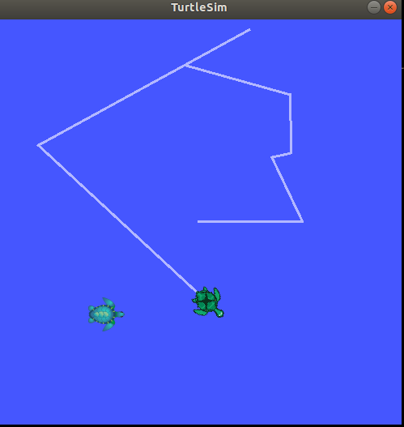
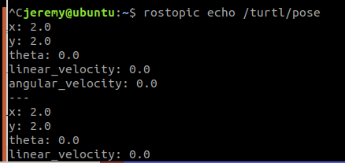

# Exercises

Below you can find some recap exercises.

But first try to add a new turtle. You don't have to stop the rosnode turtlesim.

An additional turtle can be spawn with a service parameter `/spawn`

The info of the ros parameter can be looked up with:

```shell
rosservice call /spawn info
```

Output

```shell
Node: /turtlesim
URI: rosrpc://127.0.0.1:49803
Type: turtlesim/Spawn
Args: x y theta name
```

With example command a second turtle will be spawn.

```shell
rosservice call /spawn 3 3 0 turtle2
```





To delete a turtle the command below can be used:

```shell
rosservice call /kill "name: 'turtle2'"
```

::: warning
It isn't possible to move the second turtle with the turtle_teleop_key.
:::


## Exercise 1 
Try to move the second turtle to position `-2 -2  1` (`x y theta`) by terminal

::: details Solution Exercise 1
```shell
rosservice call /turtle1/teleport_absolute 2 2 0 
```
:::

## Exercise 2 
Try to read out the current position of the second turtle by terminal

::: details Solution Exercise 2

```shell
rostopic echo /turtle2/pose 
```



:::

## Exercise 3 
Try to control the turtle by command (cmd_vel) to used updaterate should be 10ms by terminal

::: details Solution Exercise 3

```shell
rostopic pub /turtle2/cmd_vel geometry_msgs/Twist -r 1 -- '[1.0, 0.0, 0.0]' '[0.0, 0.0, 1.8]' 

rostopic pub /turtle2/cmd_vel geometry_msgs/Twist "linear:
  x: 1.0
  y: 0.0
  z: 0.0
angular:
  x: 0.0
  y: 0.0
  z: 0.0" -r 10
```

::: 

## Exercise 4
Try to visualise the current position in `rqt_plot` by terminal

::: details Solution Exercise 4
```shell
rqt_plot  -e /turtle2/pose/x:y:z
```
:::

## Exercise 5
Try to find the update rate of cmd_vel of the second turtle by terminal

::: details Solution Exercise 5
```shell
rostopic hz /turtle2/cmd_vel 
```
:::
## Exercise 6
Try to change the  color of the pen set by the turtle on the screen.

::: tip
check the `rosservice list`
:::

::: details Solution Exercise 6
```shell
rosservice list
rosservice info /turtle2/set_pen 
rosservice call /turtle2/set_pen 125 125 125 2  0
```
:::
