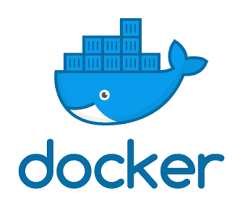

# Installation

## Introduction 
To make the installation of ROS and the Turtlesim example easy we will be using [Docker](https://www.docker.com/) to setup everything up.

One of the advantages is that the application can be run on Linux and Windows([WSL](https://docs.microsoft.com/en-us/windows/wsl/install)). 
Furthermore all needed packages are installed automatically with use of a Dockerfile.




To get everything running. The following steps have to be done:

1. [Install Docker](#install-docker)  
   1. Install Docker on Ubuntu
   2. [Install Docker on Windows](#installation-wsl-on-windows-pc)
2. Build the Dockerfile
3. Run the Docker container

### Requirements
* PC with Windows OS (admin rights needed)
* Or PC with Ubuntu OS (sudo rights needed)

## Install Docker

### Installation on Ubuntu
To install Docker on ubuntu following [link](https://docs.docker.com/engine/install/ubuntu/)

### Installation on Windows

If we want to use Docker on a Windows PC. We will have to use [WSL](https://docs.microsoft.com/en-us/windows/wsl/install) (Windows Subsystem for Linux)
and [Docker Desktop](https://www.docker.com/products/docker-desktop). In the following steps we will correctly install them.

#### Installation WSL2 on Windows PC

You can now install everything you need to run  ([WSL](https://docs.microsoft.com/en-us/windows/wsl/install)) by entering this command in as **administrator** 
in the Windows Command Prompt or Powershell.

```shell
wsl --install
```
source: https://docs.microsoft.com/en-us/windows/wsl/install
 
Get/check version of WSL

To check the WSL mode, run:

```shell
wsl.exe -l -v
```

::: tip
To upgrade your existing Linux distro to v2, run:

```shell
wsl.exe --set-version (distro name) 2
```

To set v2 as the default version for future installations, run:

`````shell
wsl.exe --set-default-version 2
`````

:::
#### Installation of Docker Desktop

**Download**

Download [Docker Desktop](https://hub.docker.com/editions/community/docker-ce-desktop-windows) or a later release.

**Install**

Ensure you have completed the steps described in the Prerequisites 
section before installing the Docker Desktop Stable release.

1. Follow the usual installation instructions to install Docker Desktop. If you are running a supported system, Docker Desktop prompts you to enable WSL 2 during installation. Read the information displayed on the screen and enable WSL 2 to continue.
2. Start Docker Desktop from the Windows Start menu.
3. From the Docker menu, select Settings > General.
4. Select the Use WSL 2 based engine check box. 
If you have installed Docker Desktop on a system that supports WSL 2, this option will be enabled by default.


5. Click Apply & Restart.

6. Ensure the distribution runs in WSL 2 mode. WSL can run distributions in both v1 or v2 mode.
To check the WSL mode, run:

```shell
wsl.exe -l -v
```
To upgrade your existing Linux distro to v2, run:

```shell
wsl.exe --set-version (distro name) 2
```

To set v2 as the default version for future installations, run:

```shell
wsl.exe --set-default-version 2
```

When Docker Desktop restarts, go to **Settings > Resources > WSL Integration**.

The Docker-WSL integration will be enabled on your default WSL distribution. 
To change your default WSL distro, run 

```shell
wsl --set-default <distro name>.
```

For example, to set Ubuntu as your default WSL distro, run 

```shell
wsl --set-default ubuntu.
```
Optionally, select any additional distributions you would like to enable the Docker-WSL integration on.

source: https://docs.docker.com/desktop/windows/wsl/ 

## The DockerFile
To run ROS and the turtlesim package on Ubuntu or WSL we will use Docker. 
To running everything a [Dockerfile](https://docs.docker.com/engine/reference/builder/) has to been prepared.

For this tutorial a Dockerfile is already made for:

* ROS Melodic 
* ROS Foxy (TODO)

To get everything running the Dockerfile has to be build on your computer. 
When building the Dockerfile, Docker downloads every necessary resource on your PC. 
At the end a Docker Image (template) is the result. That image can be used later on to run or start a Docker container.

::: tip
Take a look at the [Docker Hub](https://hub.docker.com/) Hub for more interesting Docker images
:::

Make a directory on your pc and go in the directory

```shell
mkdir turtlesim_docker
cd turtlesim_docker
```

Create the Dockerfile in the directory

```shell
nano Dockerfile
```
::: warning
The docker file name is case sensitive. If it isn't written correctly like `Dockerfile` i won' work!
::: 

Below you can find the complete Dockerfile in the dropdown menu. You have to paste this in the Dockerfile.
::: tip
You can alter it be own flavor if needed.
:::
<details>

<summary>Dockerfile Melodic Full </summary>
<p>

```dockerfile
FROM osrf/ros:melodic-desktop-full

# Install linux packages
RUN apt-get update && apt-get install -y \
locales \
lsb-release \
git \
subversion \
nano \
terminator \
xterm \
wget \
curl \
htop \
libssl-dev \
build-essential \
dbus-x11 \
software-properties-common \
build-essential \
ssh

RUN apt-get clean && rm -rf /var/lib/apt/lists/*


# Configure ROS
RUN rosdep update
RUN echo "source /opt/ros/melodic/setup.bash" >> /root/.bashrc
RUN echo "export ROSLAUNCH_SSH_UNKNOWN=1" >> /root/.bashrc
RUN echo "source /opt/ros/melodic/setup.zsh" >> /root/.zshrc
RUN echo "export ROSLAUNCH_SSH_UNKNOWN=1" >> /root/.zshrc


# Entry script - This will also run terminator
#COPY assets/entrypoint_setup.sh /
#ENTRYPOINT ["/entrypoint_setup.sh"]

#### copy ros_entrypoint.sh
COPY ros_entrypoint.sh /
RUN chmod a+x /ros_entrypoint.sh

#### create entrypoint
ENTRYPOINT ["/ros_entrypoint.sh"]
CMD ["bash"]

RUN /bin/bash -c 'source /opt/ros/melodic/setup.bash &&\
   sudo mkdir -p  /root/home/catkin_ws/src &&\
  cd /root/home/catkin_ws/src &&\
   catkin_init_workspace &&\
   cd /root/home/catkin_ws &&\
  catkin_make'

# Source: https://robotics.stackexchange.com/questions/21959/docker-dockerfile-bin-bash-catkin-init-workspace-catkin-make-command-not

RUN  cd /root/home/catkin_ws/src \
   && git clone -b melodic-devel https://github.com/ROBOTIS-GIT/turtlebot3_msgs.git \
   && git clone -b melodic-devel https://github.com/ROBOTIS-GIT/turtlebot3.git \
   && git clone -b melodic-devel https://github.com/ROBOTIS-GIT/turtlebot3_simulations.git \
  && cd /root/home/catkin_ws

RUN /bin/bash -c 'source /opt/ros/melodic/setup.bash &&\
    cd /root/home/catkin_ws &&\
    catkin_make'

RUN echo "source root/home/catkin_ws/devel/setup.bash" >> /root/.bashrc
#CMD ["terminator"]
```
</p>
</details>


## Building the Dockerfile

To build the Dockerfile use the command below in your terminal.

```shell
docker build -t ros-turtle  .
```
::: warning
Done forget the `.` in the command above. Otherwise you will get an error.
:::
If it is the first time it can take a while.

If all goes well a docker image has been generate. Normally you can see the Docker image name (`ros-turtle:latest`)it in the last line of the terminal output.

```shell
#### Running command: "make -j16 -l16" in "/root/home/catkin_ws/build"
####
Removing intermediate container 6772c3d47887
 ---> 59dc693e43c0
Step 18/18 : RUN echo "source root/home/catkin_ws/devel/setup.bash" >> /root/.bashrc
 ---> Running in e5ac70489002
Removing intermediate container e5ac70489002
 ---> 849222a0c02a
Successfully built 849222a0c02a
Successfully tagged ros-turtle:latest
```
::: warning
Make sure it has the name `ros-turtle` in it. Because in the next step (Running the image) we use that specific name.
:::


## Run Docker container

To run the Docker image `ros-turtle` to a Docker container use the bash script below.

Make a bash script by in the same directory (`turtlesim_docker`):

```shell
nano run_image_ros.bash
```

Paste the script below in the file.

```bash
#!/bin/bash

export ROS_REMOTE_PC=127.0.0.1
export ROS_PORT=11311
export ROS_MASTER_CONTAINER=turtlebot3-rosmaster1:1_0_0
export TURTLEBOT3_MODEL=burger

# END MODIFY

docker run -it \
    --env="DISPLAY=$DISPLAY" \
    --env="QT_X11_NO_MITSHM=1" \
    --volume="/tmp/.X11-unix:/tmp/.X11-unix:rw" \
    --env="XAUTHORITY=$XAUTH" \
    --volume="$XAUTH:$XAUTH" \
    --mount source=turtlesimvolume,destination=/root/home/catkin_ws \
    --env "ROS_MASTER_URI=http://$ROS_REMOTE_PC:$ROS_PORT" \
    --env "ROS_HOSTNAME=$ROS_REMOTE_PC" \
    --env "TURTLEBOT3_MODEL=$TURTLEBOT3_MODEL" \
    --name turtlesim_cont \
    --rm \
    ros-turtle \
    bash
```

To run the Docker container, execute the bash script by the use of the terminal.

```shell
./run_image_ros.bash
```

You will see that you are logged in successfully into the Docker container. 

```shell
root@b100bd1c4296:/# 
```

To efficiently use ROS most of the time to need multiple terminal screens. 
To connect to the Docker container the following command is needed evertime you need a new terminal.
With this command you execute (`exec`) a interactive (`-it`) connection with 
Docker container (`turtlesim_cont`) by using the terminal (`bash`)

```shell
docker exec -it turtlesim_cont bash
```


You can now start to explore the wonderful world of ROS. :)

If you want to exit the container. Just type `exit` in the terminal

```shell
exit
```
