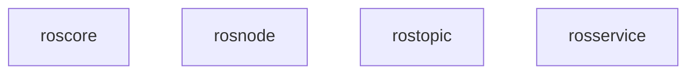
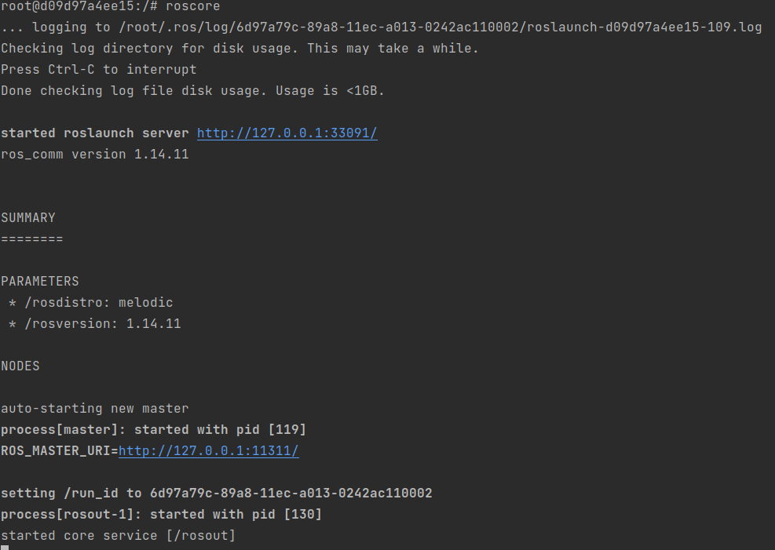
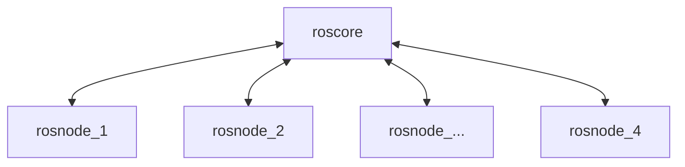
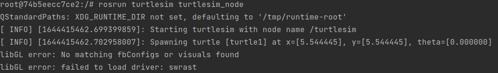
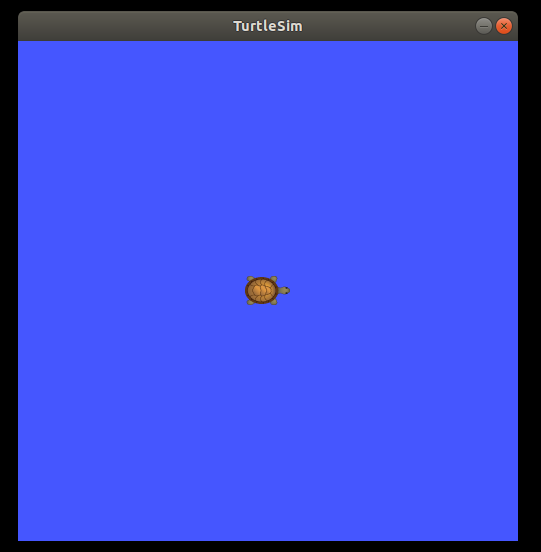
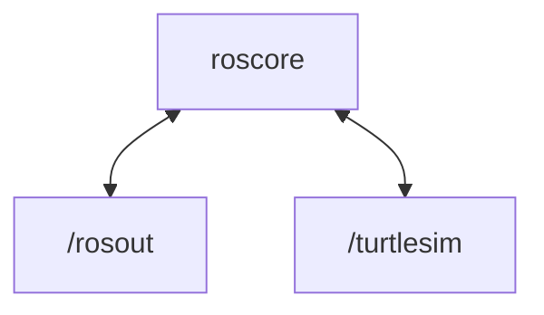
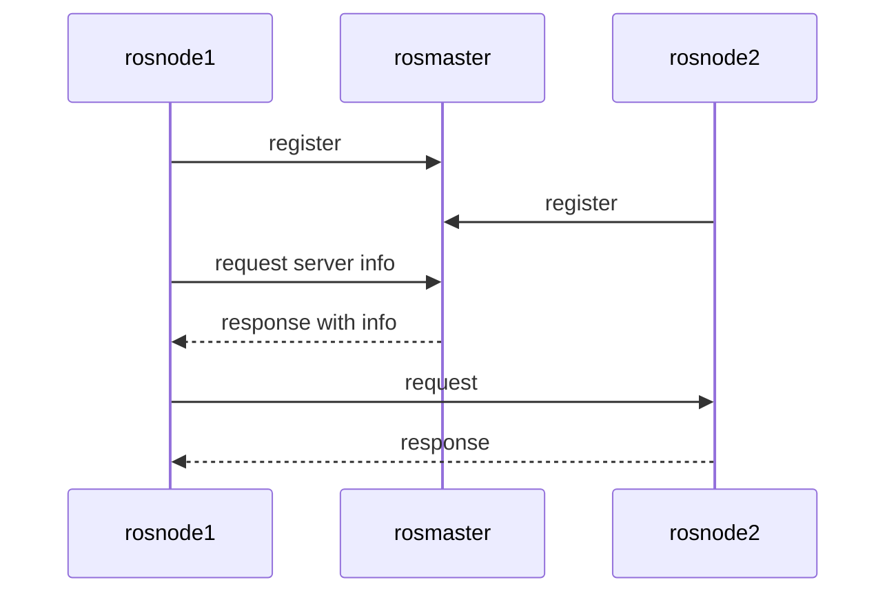
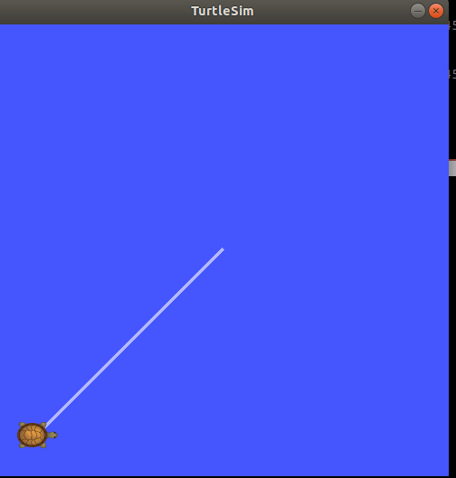
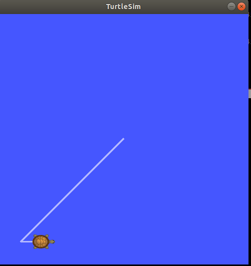

# ROS components

In section the different kinds of ros components are handled. 
Each time illustrated with an example on the turtlesim:

The following compenents will be handled:



* roscore
* rosnode
* rostopic
* rostopic


## roscore 

The `roscore` command starts ROS and creates the Master so that ROS nodes can communicate. 

The ROS master coordinates the communication between the different ROS nodes (processes). 
Each ROS node registers with the ROS master at start-up. The ROS master can/should be started via the command.

::: warning
There can only be **one** ROS master. When starting up a 2nd ROS master, the first ROS master is turned off.
:::

::: warning
Make sure that you work in the container environment!
:::

```shell
roscore	
```



From the ROS tutorial 

`roscore`is a collection of nodes and programs that are pre-requisites of a ROS-based system. 
You must have a roscore running in order for ROS nodes to communicate. It is launched using the roscore command. 

NOTE: If you use roslaunch, it will automatically start roscore if it detects that it is not already running. 

roscore will start up: 

* ROS Master 
* ROS Parameter Server 
* rosout logging node 

source: [wiki ros](http://wiki.ros.org/roscore) 

::: warning
Leave this window active but minimized so that the ROS Master is still available. 
:::
 
## rosnode



A ROS node is an executable program (executable file) contained in a ROS package. 
The ROS nodes use the ROS client library which allows to communicate with other nodes. 
Nodes can publish or subscribe to one or more topics. 
Nodes can also offer or use a service. There are 2 types of client libraries:
* rospy: python client library
* roscpp: c++ client library gfhfh


We will start the turtlesim node and explore its properties. 
Execute a turtlesim node in a new terminal  from the package turtlesim.


::: warning

`roscore` should already be running otherwise you will receive an error

```bash
roscore
```
:::

Connect with the Docker container with a new terminal.

```shell
docker exec -it turtlesim_cont bash
```

Start the turtlesim node with `rosrun`

```bash
rosrun turtlesim turtlesim_node 
```




The rosrun command takes the arguments `[package name]` `[node name]`. 
The node creates the screen image and the turtle.

<p align="center">

</p>

Here the turtle is in the center in x=5.5, y=5.5 with no rotation. 


Before moving the turtle, let's study the properties of the node available with turtlesim package in another window. 

#### Get node list  

With argument `list` we can look up the existing/active ROS nodes.
Execute this command again in a new terminal connected to the container.

```shell
docker exec -it turtlesim_cont bash
```
Add the command below in the new terminal

```bash
rosnode list
```

Output: 

```bash
/rosout 
/turtlesim 
```

We can see that there are 2 ros nodes active.

<p align="center">



</p>

::: tip Important
Note the difference in notation between the node `/turtlesim` and the package `turtlesim`. 
:::


#### Get info of node 

To get the info of the turtlesim node add the command in the container terminal. 
Reuse the terminal of the previous step.


```bash
rosnode info /turtlesim 
```
Output:

```shell
--------------------------------------------------------------------------------
Node [/turtlesim]
Publications: 
 * /rosout [rosgraph_msgs/Log]
 * /turtle1/color_sensor [turtlesim/Color]
 * /turtle1/pose [turtlesim/Pose]

Subscriptions: 
 * /turtle1/cmd_vel [unknown type]

Services: 
 * /clear
 * /kill
 * /reset
 * /spawn
 * /turtle1/set_pen
 * /turtle1/teleport_absolute
 * /turtle1/teleport_relative
 * /turtlesim/get_loggers
 * /turtlesim/set_logger_level


contacting node http://127.0.0.1:33755/ ...
Pid: 252
Connections:
 * topic: /rosout
    * to: /rosout
    * direction: outbound (47461 - 127.0.0.1:38932) [16]
    * transport: TCPROS
```


## rosservice 
A ROS service is an example of synchronous communication. It is based on the Request and Response system. 
Some ROS nodes provide a ROS service with a specific name. 
Clients can request a request from the service and have to wait for a response. 
The principle of communication can be compared to a telephone conversation between 2 ROS nodes. 
However, this is intended for short-term communication between 2 nodes.





#### Get ROS services 

To get all the supported services of a rosnode. Use the command below.

 ```shell
rosnode info /turtlesim 
```

Output

```shell
...
Services: 
 * /clear
 * /kill
 * /reset
 * /spawn
 * /turtle1/set_pen
 * /turtle1/teleport_absolute
 * /turtle1/teleport_relative
 * /turtlesim/get_loggers
 * /turtlesim/set_logger_level
...
```

The turtlesim node supports 9 services.

With these service we can read out the node but also command the node depending on the feature.

The format of a rosservice call `rosservice <service>` `<arguments>` is the following

The turtle can be moved using the `rosservice` teleport option. The format of the position is `[x y theta]`. 

To get the info of a specific rosservice use the command below

 ```bash
rosservice info /spawn
 ```
Output:

 ```bash
Node: /turtlesim
URI: rosrpc://127.0.0.1:47461
Type: turtlesim/Spawn
Args: x y theta name
 ```

#### Example rosservices turtlesim

**teleport_absolute**

 ```bash
rosservice call /turtle1/teleport_absolute 1 1 0 
 ```

 


**teleport_relative** 

The relative teleport option moves the turtle with respect to its present position. 
The arguments are [linear, angle] 

 ```bash
rosservice call /turtle1/teleport_relative  1 0 
 ```



**Exercise 1**

Try to move the turtle to location x=2, y=1.

::: details Solution Exercise 1
```bash
rosservice call /turtle1/teleport_absolute 2 1 0 
```
:::

**Exercise 2**

Try to change the pen color of the turtle.

::: details Solution Exercise 2

Get the info of the service

```shell
rosservice info /turtle1/set_pen
```

**Output**

```shell
Node: /turtlesim
URI: rosrpc://127.0.0.1:47461
Type: turtlesim/SetPen
Args: r g b width off
```

```shell
rosservice call /turtle1/set_pen 100 150 100 3 0
```
:::

## rostopic

ROS nodes can communicate with each other via ROS topics. 
ROS nodes can publish a ROS Topic but can also subscribe (subscribe) to an existing ROS topic. 
In most cases there is one publisher and several subscribers. 
The topics are streamed asynchronously. It can be compared to a chat room.

The node `/turtlesim` publishes three topics and subscribes to the `/turtle1/cmd_vel` topic. 

#### Examples rostopics

**Turtlesim pose** 

Another topic for turtlesim node is the turtles pose. This is the x, y position, angular direction, 
and the linear and angular velocity of the turtle. 

The following command gives insight in following items:
* Type of the topic
* How is publishing the topic
* How is subscribed to the topic 

We start with the turtlesim pose topic

 ```shell
rostopic info /turtle1/pose 
 ```

Output

 ```shell
Type: turtlesim/Pose

Publishers: 
 * /turtlesim (http://127.0.0.1:33755/)

Subscribers: None
 ```
A rostopic is always based on a **rosmsg** (ROS message) structure.

To get the ROS message name used by the ROS topic use the command below.

 ```shell
rostopic type /turtle1/pose 
 ```
Output:

 ```shell
turtlesim/Pose
 ```

To get the specific structure of the ros message use the command below.

```shell
rosmsg show turtlesim/Pose 
 ```

Output:

 ```shell
turtlesim/Pose
root@74b5eecc7ce2:/# rosmsg show turtlesim/Pose
float32 x
float32 y
float32 theta
float32 linear_velocity
float32 angular_velocity
 ```

To read the actual values of the ROS topic use the `rostopic echo` command

```shell
rostopic echo /turtle1/pose 
 ```

Output:

 ```shell
x: 6.0
y: 1.0
theta: 0.0
linear_velocity: 0.0
angular_velocity: 0.0
---
x: 6.0
y: 1.0
theta: 0.0
linear_velocity: 0.0
angular_velocity: 0.0
---
 ```

We get a continuous output of the position, orientation, and velocities. 
Compare to the position on the turtle window. 
To stop the output press `CTRL+C`.

Extra info: [http://wiki.ros.org/ROS/Tutorials/UnderstandingTopics](http://wiki.ros.org/ROS/Tutorials/UnderstandingTopics)


## rosparam

ROS parameters allows data to be stored via key/name in a central location. 
This means that these parameters are globally visible. ROS parameters are intended to store configuration data:
* Update hardware drivers
* Algorithms Adjustment

**Not intended for high polling rates. Not intended for queries.**

To get an overview of the existing rosparam use the list argument.

```shell
rosparam list
```

Output

```shell
/rosdistro
/roslaunch/uris/host_127_0_0_1__46711
/rosversion
/run_id
/turtlesim/background_b
/turtlesim/background_g
/turtlesim/background_r

```

We want to get parameters and change color of background to Red 
```shell
rosparam get /turtlesim/background_r
```

:::tip
use Tab to get the available rosparams
:::

To change a rosparam use the argument `set`

```shell
rosparam set /turtlesim/background_r 0
```

This changes the parameter value, 
now we have to call the clear service for the parameter change to take effect:

```shell
rosservice call /clear
```
