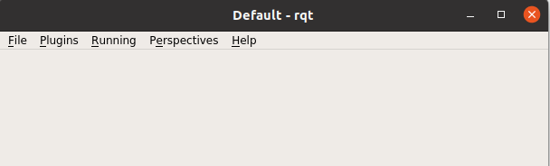
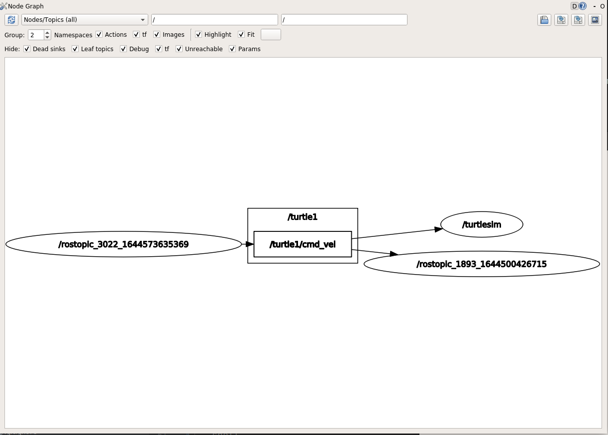

# ROS tools

ROS comes with some additional tools to support the roboticist. Not everthing can be done in [CLI](https://nl.wikipedia.org/wiki/Command-line-interface) ...

For this tutorial not all tools are usable because of the limited functions of the robot and environment (2D).
We will only focus on the rqt tools. rviz and gazebo won't be used.

* **rqt**: A group of qt-tools. 
* **rviz**: is a three-dimensional visualizer used to visualize robots, the environments they work in, and sensor data. 
It is a highly configurable tool, with many different types of visualizations and plugins.
* **gazebo**: 3D simulation environment, very interesting for testing your robot in simulation.

::: tip INFO
`rviz` and `gazebo` are not used in this tutorial.
:::


## rqt

rqt stand for ROS QT applications. 
It is not one tool but multiple interesting tools bundled together to make it easy for the programmer.

You can start rqt with the command `rqt` in the terminal. 
By selecting the item Plugins you can select many different tools

```shell
rqt
```



By selecting the item Plugins you can select many different tools

For this tutorial we will only handle a few plugins. If you want to know more see [wiki rqt](http://wiki.ros.org/rqt)
Some plugins can be started with a separate command (rqt_plot, rqt_graph)


## rqt_graph
With rqt_graph it is possible to generate a graph of all active ROS nodes and published ROS topics.
This can be very interesting to diagnose the system.

Make sure that the turtle is moving by execute the command below. The turtle should move in circles

```shell
rostopic pub /turtle1/cmd_vel geometry_msgs/Twist -r 1 -- '[2.0, 0.0, 0.0]' '[0.0, 0.0, 1.8]' 
```



## rqt_plot 

The information of all nodes and topics is available by CLI but most of the times not so usable for visualization of values. 
With rqt_plot you can plot values into graph.

Make sure that the turtle is moving by execute the command below. The turtle should move in circles

```shell
rostopic pub /turtle1/cmd_vel geometry_msgs/Twist -r 1 -- '[2.0, 0.0, 0.0]' '[0.0, 0.0, 1.8]' 
```

Now we can plot information about the nodes and topics. 

```shell
rqt_plot /turtle1/pose/x:y:z 
```


Turtle is turning in a circle about 5.5 Ymin	x goes from about 4.5 to 6.5. 
Selection of  Axis for rqt_plot  (Click on the check mark) 
Experiment with different  controls allowed for the plot such as changing the scales, etc. 


#### Exercise

Try to added the x (linear) and z (angular) value of the ROS topic cmd_vel to the same rqt_plot
Add the argument `-e` to empty the topics from the plot

```shell
rqt_plot  -e /turtle1/pose/x:y:z ....
```


::: tip
Try to look up the correct parameters with the following commands

```shell
rostopic type /turtle1/cmd_vel 
rostopic type /turtle1/cmd_vel | rosmsg show 
```

:::

::: details Solution


```shell
rqt_plot -e /turtle1/cmd_vel/linear/x /turtle1/cmd_vel/angular/z /turtle1/pose/x:y:z
```
:::


