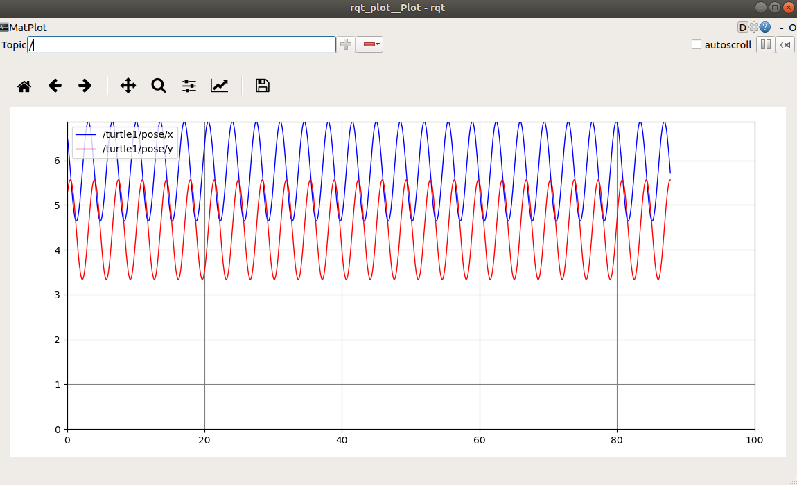

# ROS tools

ROS comes with some additional tools to support the roboticist. Not everthing can be done in cli...

For this tutorial not all tools are usable because of the limited function of the robot and environment (2D).
We will only focus on the rqt tools. rviz and gazebo won't be used.

* **rqt**: A group of qt-tools. 
* **rviz**: is a three-dimensional visualizer used to visualize robots, the environments they work in, and sensor data. 
It is a highly configurable tool, with many different types of visualizations and plugins.
* **gazebo**: 3D simulation environment, very interesting for testing your robot in simulation.

::: tip info
`rviz` and `gazebo` are not used in this tutorial because visualisation of data with turtlesim is very limited.
:::


## rqt

rqt stand for ROS QT applications. 


## rqt_graph
With rqt_graph it is possible to generate a graph of all active ROS nodes and published ROS topics.


## rqt_plot 

The information of all nodes and topics is available by cli but most of the times to so usable. 
With rqt_plot you can plot values into graph.

Make sure that the Tutlesim is move by execute the command below. The turtle should move in circles

```bash
rostopic pub /turtle1/cmd_vel geometry_msgs/Twist -r 1 -- '[2.0, 0.0, 0.0]' '[0.0, 0.0, 1.8]' 
```

Now we can plot information about the nodes and topics. 

```shell
rqt_plot /turtle1/pose/x:y:z 
```


Turtle is turning in a circle about 5.5 Ymin	x goes from about 4.5 to 6.5. 
Selection of  Axis for rqt_plot  (Click on the check mark) 
Experiment with different  controls allowed for the plot such as changing the scales, etc. 

Plot of /turtle1/pose/x and /pose/y 

Period of just over 3 seconds for 360 degree rotation. Note the periodic motion in x and y. 
Right click to change values for axes, etc. Choosing only x and y positions and experimenting with scales and autoscroll. 
See the tutorial for further help. 
http://wiki.ros.org/rqt_plot 


#### Exercise

Try to added the x (linear) and z (angular) value of the ROS topic cmd_vel to the same rqt_plot
Add the argument `-e` to empty the topics from the plot

```bash
rqt_plot  -e /turtle1/pose/x:y:z ....
```


::: tip
Try to look up the correct parameters with the following commands

```bash
rostopic type /turtle1/cmd_vel 
rostopic type /turtle1/cmd_vel | rosmsg show 
```
:::

::: details Solution

```bash
rqt_plot -e /turtle1/cmd_vel/linear/x /turtle1/cmd_vel/angular/z /turtle1/pose/x:y:z
```
:::


