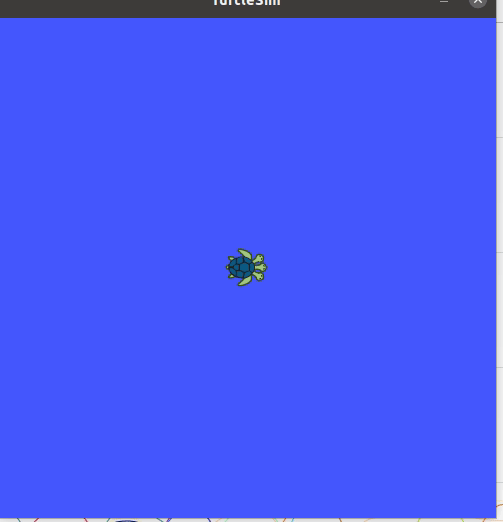

# Turtlesim &amp; python

In the previous sections we controlled the turtle mainly by terminal. For most of the case this isn't that interesting.
That is why we will be controlling the turtle with a own written python script.


Before creating the python script make sure you're in the correct directory!

::: tip WHY?
If you save the files in the wrong directories all will be lost if you exit the container environment. :O Noooo!

In the Dockerfile is described that the directory `/root/home/catkin_ws` is saved. (for the experts: connected to a Docker volume)
:::

```shell
cd ~/home/catkin_ws/src/turtlebot3_simulations/turtlebot3_simulations
mkdir scripts
cd scripts
```

::: warning IMPORTANT
Make sure that `roscore` and `turtlesim_node` are still running.
Stop all other terminal execution by `CTRL+C`
:::

The following things will be handled in this section

1. Subscribe to a rostopic 
2. Move the turtle linear

## Subscribe to a rostopic

The objective of this script is to read the position (`Pose`) of the turtle.
We will have to subscribe to the `/turtle1/Pose` topic

::: warning 
Work in the following directory!

```shell
cd ~/home/catkin_ws/src/turtlebot3_simulations/turtlebot3_simulations/scripts
```
:::

Create a Python script `turtlesubscribe.py `and make executable (`chmod +x turtlesubscribe.py`). 

```shell
touch turtlesubscribe.py
```

Be sure to be in the correct directory where the program is located.
Make Executable 

```shell
chmod +x turtlesubscribe.py
```

::: warning
If `chmod +x` is not execute onto the python script it won't run!
:::

If you execute the command `ls` in the terminal you will see 
that the name `turtlesubscribe.py`should be green. 
That indicates that it is executable.

```shell
ls
```

Add the code below to the python script. Open it with `nano` editor

```shell
nano turtlesubscribe.py 
```
::: tip
Paste it with `CTRL + SHIFT + V` in nano editor
:::

With `CTRL + S` you can save the file and with `CTRL + X` you can close the file.

```python
#!/usr/bin/env python 
# Set linear and angular values of Turtlesim's speed and turning. 

import rospy    # Needed to create a ROS node 
    # Message that moves base   
from turtlesim.msg import Pose

class ReadTurtlesim: 
        def __init__(self): 
                
                # ControlTurtlesim is the name of the node sent to the master
                rospy.init_node('TurtleSubcribe', anonymous=False) 
                # Message to screen 
                rospy.loginfo(" Press CTRL+c to stop TurtleBot") 
                # Keys CNTL + c will stop script 
                rospy.on_shutdown(self.shutdown) 
            # Publisher will send Twist message on topic 
            # /turtle1/cmd_vel 
                self.pose_subscriber = rospy.Subscriber('/turtle1/pose', Pose, self.callbackPose)
                rospy.spin()
        def callbackPose(self,msg):
                print("test")
                print(msg)
        

        def shutdown(self): 
                # You can stop turtlebot by publishing an empty Twist message 
                rospy.loginfo("Stopping Turtlesim") 
        # Give TurtleBot time to stop
        rospy.sleep(1) 


if __name__== "__main__": 
    try:
        ReadTurtlesim() 
    except: 
    	rospy.loginfo("End of the trip for Turtlesim") 

```


## Move the turtle linear

The objective is here to move the turtle with the use of the rostopic `cmd_vel`. 
We will have to **publish** the rostopic.


::: warning 
Work in the following directory!   

```shell
~/home/catkin_ws/src/turtlebot3_simulations/turtlebot3_simulations/scripts
```
:::

Create a Python script `turtlemove.py `and make executable (`chmod +x turtlemove.py`). 

```shell
touch turtlemove.py
```

Be sure to be in the correct directory where the program is located.
Make Executable 

```shell
chmod +x turtlemove.py
```

::: warning
If `chmod +x` is not execute onto the python script it won't run!
:::

If you execute the command `ls` in the terminal 
you will see that the name `turtlemove.py`should be green. 
That indicates that it is executable.

```shell
ls
```

Add the code below to the python script. Open it with `nano` editor

```shell
nano turtlemove.py 
```
::: tip
Paste it with `CTRL + SHIFT + V` in nano editor
:::

With `CTRL + S` you can save the file and with `CTRL + X` you can close the file.

```python
#!/usr/bin/env python 
# Set linear and angular values of Turtlesim's speed and turning. 

import rospy	# Needed to create a ROS node 
from geometry_msgs.msg import Twist    # Message that moves base 	


class ControlTurtlesim: 
	def __init__(self): 
		
		# ControlTurtlesim is the name of the node sent to the master
		rospy.init_node('ControlTurtlesim', anonymous=False) 
		# Message to screen 
		rospy.loginfo(" Press CTRL+c to stop TurtleBot") 
		# Keys CNTL + c will stop script 
		rospy.on_shutdown(self.shutdown) 
	    # Publisher will send Twist message on topic 
	    # /turtle1/cmd_vel 
		self.cmd_vel = rospy.Publisher('/turtle1/cmd_vel', Twist, queue_size=10) 

	    # Turtlesim will receive the message 10 times per second. 
		rate = rospy.Rate(10); 
	    # 10 Hz is fine as long as the processing does not exceed 
	    #   1/10 second. 
		rospy.loginfo(" Set rate 10Hz") 
	    # Twist is geometry_msgs for linear and angular velocity 
		move_cmd = Twist() 
	    # Linear speed in x in meters/second is + (forward) or 
	    #    - (backwards) 
		move_cmd.linear.x = 0.3   # Modify this value to change speed 
	    # Turn at 0 radians/s 
		move_cmd.angular.z = 0 
	    # Modify this value to cause rotation rad/s 

            # Loop and TurtleBot will move until you type CNTL+c 
        	while not rospy.is_shutdown(): 
                    # publish Twist values to the Turtlesim node /cmd_vel
            		self.cmd_vel.publish(move_cmd) 
                    # wait for 0.1 seconds (10 HZ) and publish again 
            		rate.sleep() 

	def shutdown(self): 
    		# You can stop turtlebot by publishing an empty Twist message 
   		rospy.loginfo("Stopping Turtlesim") 
   		self.cmd_vel.publish(Twist()) 
   		 # Give TurtleBot time to stop
    		rospy.sleep(1) 

if __name__== "__main__": 
    try:
        ControlTurtlesim() 
    except: 
    	rospy.loginfo("End of the trip for Turtlesim") 

```

```bash
python turtlemove.py 
```

You will see that the turtle moves in forward direction.

To stop the script press `CTRL + C` in the terminal

::: tip
The position of the turtle can be reseted by the following command:

```shell
rosservice call /reset 
```
:::

#### Exercise 1  
Try to move the turtlebot backwards with a script

::: tip 
* forward movement: positive
* backward movement : negative
:::

::: details Solution Exercise 1

Change line 30 in the python script to the following

```python
move_cmd.linear.x = -0.3 
```
:::

#### Exercise 2  
Try to move the turtlebot forward in a circle with a script

::: tip 
* linear: forward/backward
* angular: turning
:::

::: details Solution Exercise 2

Change line 30 in the python script to the following

```python
move_cmd.linear.x = 1.0 
move_cmd.angular.z = 0.8 
```
:::


## Moving to goal

The objective is here to move the turtle to a specific goal. This by using the combination of the `cmd_vel` and `pose` topic
By reading the current pose of the turtle (subscribing to the `pose` topic ) and comparing by the requested goal the `cmd_vel` can be published.

::: warning 
Work in the following directory!   

```shell
~/home/catkin_ws/src/turtlebot3_simulations/turtlebot3_simulations/scripts
```
:::

Create a Python script `turtlemovegoal.py `and make executable (`chmod +x turtlemovegoal.py`). 

```shell
touch turtlemovegoal.py
```

Be sure to be in the correct directory where the program is located.
Make Executable 

```shell
chmod +x turtlemovegoal.py
```

::: warning
If `chmod +x` is not execute onto the python script it won't run!
:::

If you execute the command `ls` in the terminal 
you will see that the name `turtlemovegoal.py`should be green. 
That indicates that it is executable.

```shell
ls
```

Add the code below to the python script. Open it with `nano` editor

```shell
nano turtlemovegoal.py 
```
::: tip
Paste it with `CTRL + SHIFT + V` in nano editor
:::

With `CTRL + S` you can save the file and with `CTRL + X` you can close the file.

::: details python code `move to goal`

```python


#!/usr/bin/env python
#!/usr/bin/env python
import rospy
from geometry_msgs.msg import Twist
from turtlesim.msg import Pose
from math import pow, atan2, sqrt


class TurtleBot:

    def __init__(self):
        # Creates a node with name 'turtlebot_controller' and make sure it is a
        # unique node (using anonymous=True).
        rospy.init_node('turtlebot_controller', anonymous=True)

        # Publisher which will publish to the topic '/turtle1/cmd_vel'.
        self.velocity_publisher = rospy.Publisher('/turtle1/cmd_vel',
                                                  Twist, queue_size=10)

        # A subscriber to the topic '/turtle1/pose'. self.update_pose is called
        # when a message of type Pose is received.
        self.pose_subscriber = rospy.Subscriber('/turtle1/pose',
                                                Pose, self.update_pose)

        self.pose = Pose()
        self.rate = rospy.Rate(10)

    def update_pose(self, data):
        """Callback function which is called when a new message of type Pose is
        received by the subscriber."""
        self.pose = data
        self.pose.x = round(self.pose.x, 4)
        self.pose.y = round(self.pose.y, 4)

    def euclidean_distance(self, goal_pose):
        """Euclidean distance between current pose and the goal."""
        return sqrt(pow((goal_pose.x - self.pose.x), 2) +
                    pow((goal_pose.y - self.pose.y), 2))

    def linear_vel(self, goal_pose, constant=1.5):
        """See video: https://www.youtube.com/watch?v=Qh15Nol5htM."""
        return constant * self.euclidean_distance(goal_pose)

    def steering_angle(self, goal_pose):
        """See video: https://www.youtube.com/watch?v=Qh15Nol5htM."""
        return atan2(goal_pose.y - self.pose.y, goal_pose.x - self.pose.x)

    def angular_vel(self, goal_pose, constant=6):
        """See video: https://www.youtube.com/watch?v=Qh15Nol5htM."""
        return constant * (self.steering_angle(goal_pose) - self.pose.theta)

    def move2goal(self):
        """Moves the turtle to the goal."""
        goal_pose = Pose()

        # Get the input from the user.
        goal_pose.x = float(input("Set your x goal: "))
        goal_pose.y = float(input("Set your y goal: "))

        # Please, insert a number slightly greater than 0 (e.g. 0.01).
        distance_tolerance = input("Set your tolerance: ")

        vel_msg = Twist()

        while self.euclidean_distance(goal_pose) >= distance_tolerance:

            # Porportional controller.
            # https://en.wikipedia.org/wiki/Proportional_control

            # Linear velocity in the x-axis.
            vel_msg.linear.x = self.linear_vel(goal_pose)
            vel_msg.linear.y = 0
            vel_msg.linear.z = 0

            # Angular velocity in the z-axis.
            vel_msg.angular.x = 0
            vel_msg.angular.y = 0
            vel_msg.angular.z = self.angular_vel(goal_pose)

            # Publishing our vel_msg
            self.velocity_publisher.publish(vel_msg)

            # Publish at the desired rate.
            self.rate.sleep()

        # Stopping our robot after the movement is over.
        vel_msg.linear.x = 0
        vel_msg.angular.z = 0
        self.velocity_publisher.publish(vel_msg)

        # If we press control + C, the node will stop.
        rospy.spin()

if __name__ == '__main__':
    try:
        x = TurtleBot()
        x.move2goal()
    except rospy.ROSInterruptException:
        pass
```
:::

Source wiki ([Moving to goal](http://wiki.ros.org/turtlesim/Tutorials/Go%20to%20Goal))

## Multiple goals

In the last example we want to navigate to 5 different points. 
You can use the same setup as the previous examples.

Make a new python script `turlepath.py `add paste the code below.

<p align="center">

</p>

::: details python code `Multiple goals`

```python
#!/usr/bin/env python
#!/usr/bin/env python
import rospy
from geometry_msgs.msg import Twist
from turtlesim.msg import Pose
from math import pow, atan2, sqrt


class TurtleBot:

    def __init__(self):
        # Creates a node with name 'turtlebot_controller' and make sure it is a
        # unique node (using anonymous=True).
        rospy.init_node('turtlebot_controller', anonymous=True)

        # Publisher which will publish to the topic '/turtle1/cmd_vel'.
        self.velocity_publisher = rospy.Publisher('/turtle1/cmd_vel',
                                                  Twist, queue_size=10)

        # A subscriber to the topic '/turtle1/pose'. self.update_pose is called
        # when a message of type Pose is received.
        self.pose_subscriber = rospy.Subscriber('/turtle1/pose',
                                                Pose, self.update_pose)

        self.pose = Pose()
        self.rate = rospy.Rate(10)
        self.path = []
        
        self.posepoint1 = Pose()
        self.posepoint1.x = 1
        self.posepoint1.y = 1
        self.posepoint1.theta= 0
        self.path.append(self.posepoint1)
	self.posepoint2 = Pose()

        self.posepoint2.x = 1
        self.posepoint2.y = 9
        self.posepoint2.theta= 0.50
        self.path.append(self.posepoint2) 
	self.posepoint3 = Pose()

        self.posepoint3.x = 9
        self.posepoint3.y = 9
        self.posepoint3.theta= 1.57
        self.path.append(self.posepoint3) 

        self.posepoint4 = Pose()
        self.posepoint4.x = 9
        self.posepoint4.y = 1
        self.posepoint4.theta= 0
        self.path.append(self.posepoint4)         

        self.posepoint5 = Pose()
        self.posepoint5.x = 5
        self.posepoint5.y = 5
        self.posepoint5.theta= 0
        self.path.append(self.posepoint5) 

    def update_pose(self, data):
        """Callback function which is called when a new message of type Pose is
        received by the subscriber."""
        self.pose = data
        self.pose.x = round(self.pose.x, 4)
        self.pose.y = round(self.pose.y, 4)

    def euclidean_distance(self, goal_pose):
        """Euclidean distance between current pose and the goal."""
        return sqrt(pow((goal_pose.x - self.pose.x), 2) +
                    pow((goal_pose.y - self.pose.y), 2))

    def linear_vel(self, goal_pose, constant=1.5):
        """See video: https://www.youtube.com/watch?v=Qh15Nol5htM."""
        return constant * self.euclidean_distance(goal_pose)

    def steering_angle(self, goal_pose):
        """See video: https://www.youtube.com/watch?v=Qh15Nol5htM."""
        return atan2(goal_pose.y - self.pose.y, goal_pose.x - self.pose.x)

    def angular_vel(self, goal_pose, constant=6):
        """See video: https://www.youtube.com/watch?v=Qh15Nol5htM."""
        return constant * (self.steering_angle(goal_pose) - self.pose.theta)
    
    def takepath(self):
	print(self.path)
        for point in self.path:
            print(point)
            self.move2goal(point)
         # If we press control + C, the node will stop.
        rospy.spin()

    def move2goal(self,point):
        """Moves the turtle to the goal."""
        goal_pose = Pose()

        # Get the input from the user.
        goal_pose.x = point.x
        
        goal_pose.y = point.y

        # Please, insert a number slightly greater than 0 (e.g. 0.01).
        distance_tolerance = 1

        vel_msg = Twist()

        try:
            while self.euclidean_distance(goal_pose) >= distance_tolerance:

            # Porportional controller.
            # https://en.wikipedia.org/wiki/Proportional_control

            # Linear velocity in the x-axis.
                vel_msg.linear.x = self.linear_vel(goal_pose)
                vel_msg.linear.y = 0
                vel_msg.linear.z = 0

            # Angular velocity in the z-axis.
                vel_msg.angular.x = 0
                vel_msg.angular.y = 0
                vel_msg.angular.z = self.angular_vel(goal_pose)

            # Publishing our vel_msg
                self.velocity_publisher.publish(vel_msg)

            # Publish at the desired rate.
                self.rate.sleep()
                
        except KeyboardInterrupt:
                print("stopped")
        # Stopping our robot after the movement is over.
        vel_msg.linear.x = 0
        vel_msg.angular.z = 0
        self.velocity_publisher.publish(vel_msg)


if __name__ == '__main__':
    try:
        x = TurtleBot()
        x.takepath()
    except rospy.ROSInterruptException:
        pass

```
:::

Interested in other examples python & turtlesim see the following link.

* [Move in straight line](http://wiki.ros.org/turtlesim/Tutorials/Moving%20in%20a%20Straight%20Line)
* [Rotating Left & Right](http://wiki.ros.org/turtlesim/Tutorials/Rotating%20Left%20and%20Right)

 
