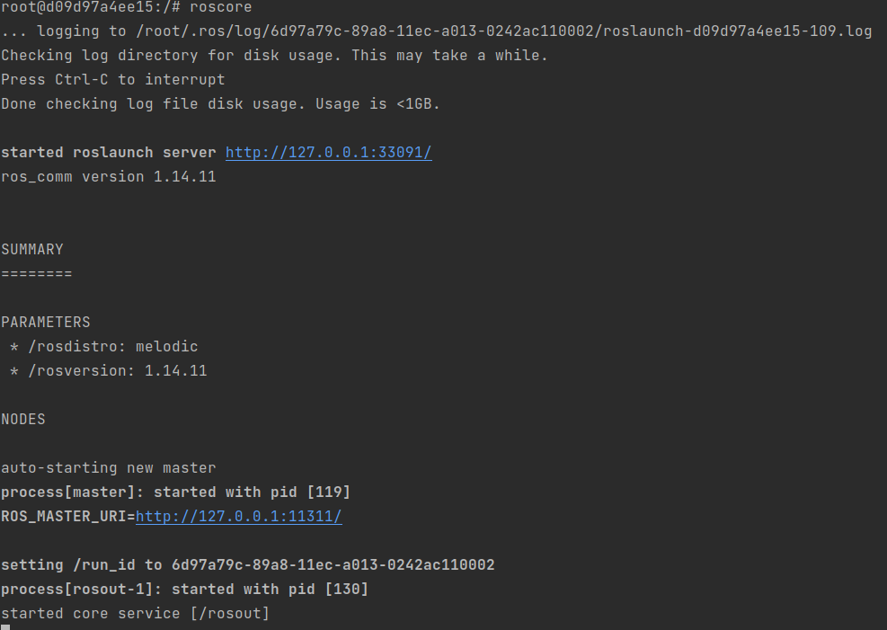
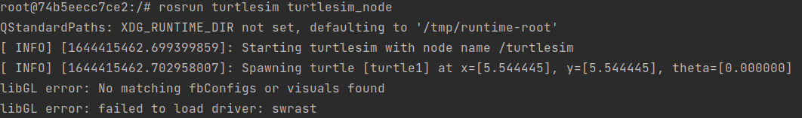

# Tutorial


## ROS Components

In section the different kinds of ros components are handled. 
Each time illustrated with an example on the turtlesim:

The following compenents will be handled:
* roscore
* rosnode
* rostopic
* rostopic
* 


### roscore 

The `roscore` command starts ROS and creates the Master so that ROS nodes can communicate. 
::: warning
Make sure that you work in the container environment!
:::

```shell
roscore	
```



From the ROS tutorial 

`roscore`is a collection of nodes and programs that are pre-requisites of a ROS-based system. 
You must have a roscore running in order for ROS nodes to communicate. It is launched using the roscore command. 

NOTE: If you use roslaunch, it will automatically start roscore if it detects that it is not already running. 

roscore will start up: 

* ROS Master 
* ROS Parameter Server 
* rosout logging node 

source: [wiki ros](http://wiki.ros.org/roscore) 
::: warning
Leave this window active but minimized so that the ROS Master is still available. 
:::
 
### rosnode 


A ROS node is an executable program (executable file) contained in a ROS package. 
The ROS nodes use the ROS client library which allows to communicate with other nodes. 
Nodes can publish or subscribe to one or more topics. 
Nodes can also offer or use a service. There are 2 types of client libraries:
* rospy: python client library
* roscpp: c++ client library gfhfh


#### Example: Turtlesim node 

We will start the turtlesim node and explore its properties. 
Execute a turtlesim node in a new terminal  from the package turtlesim.


::: warning

`roscore` should already be running otherwise you will receive an error

```bash
roscore
```
:::

Connect with the Docker container with a new terminal.

```shell
docker exec -it turtlesim_cont bash
```

Start the turtlesim node with `rosrun`

```bash
rosrun turtlesim turtlesim_node 
```




The rosrun command takes the arguments `[package name]` `[node name]`. 
The node creates the screen image and the turtle.
<p align="center">

</p>

Here the turtle is in the center in x=5.5, y=5.5 with no rotation. 


Before moving the turtle, let's study the properties of the node available with turtlesim package in another window. 

#### Get node list  

With argument `list` we can look up the existing/active ROS nodes.
Execute this command again in a new terminal connected to the container.

```shell
docker exec -it turtlesim_cont bash
```
Add the command below in the new terminal

```bash
rosnode list
```

Output: 

```bash
/rosout 
/turtlesim 
```

We can see that there are 2 ros nodes active.

<p align="center">


</p>

::: tip Important
Note the difference in notation between the node `/turtlesim` and the package `turtlesim`. 
:::


#### Get info of node 

To get the info of the turtlesim node add the command in the container terminal. 
Reuse the terminal of the previous step.


```bash
rosnode info /turtlesim 
```
Output:

```shell
--------------------------------------------------------------------------------
Node [/turtlesim]
Publications: 
 * /rosout [rosgraph_msgs/Log]
 * /turtle1/color_sensor [turtlesim/Color]
 * /turtle1/pose [turtlesim/Pose]

Subscriptions: 
 * /turtle1/cmd_vel [unknown type]

Services: 
 * /clear
 * /kill
 * /reset
 * /spawn
 * /turtle1/set_pen
 * /turtle1/teleport_absolute
 * /turtle1/teleport_relative
 * /turtlesim/get_loggers
 * /turtlesim/set_logger_level


contacting node http://127.0.0.1:33755/ ...
Pid: 252
Connections:
 * topic: /rosout
    * to: /rosout
    * direction: outbound (47461 - 127.0.0.1:38932) [16]
    * transport: TCPROS
```


### rosservice 
A ROS service is an example of synchronous communication. It is based on the Request and Response system. 
Some ROS nodes provide a ROS service with a specific name. 
Clients can request a request from the service and have to wait for a response. 
The principle of communication can be compared to a telephone conversation between 2 ROS nodes. 
However, this is intended for short-term communication between 2 nodes.


#### Get ROS services 

To get all the supported services of a rosnode. Use the command below.

 ```shell
rosnode info /turtlesim 
```

Output

```shell
...
Services: 
 * /clear
 * /kill
 * /reset
 * /spawn
 * /turtle1/set_pen
 * /turtle1/teleport_absolute
 * /turtle1/teleport_relative
 * /turtlesim/get_loggers
 * /turtlesim/set_logger_level
...
```

The turtlesim node supports 9 services.

With these service we can read out the node but also command the node depending on the feature.

The format of a rosservice call `rosservice <service>` `<arguments>` is the following

The turtle can be moved using the `rosservice` teleport option. The format of the position is `[x y theta]`. 

To get the info of a specific rosservice use the command below

 ```bash
rosservice info /spawn
 ```
Output:

 ```bash
Node: /turtlesim
URI: rosrpc://127.0.0.1:47461
Type: turtlesim/Spawn
Args: x y theta name
 ```

#### Example rosservices turtlesim

**teleport_absolute**

 ```bash
rosservice call /turtle1/teleport_absolute 1 1 0 
 ```

 


**teleport_relative** 

The relative teleport option moves the turtle with respect to its present position. 
The arguments are [linear, angle] 

 ```bash
rosservice call /turtle1/teleport_relative  1 0 
 ```


**Exercise 1**

Try to move the turtle to location x=2, y=1.

::: details Solution Exercise 1
```bash
rosservice call /turtle1/teleport_absolute 2 1 0 
```
:::

**Exercise 2**

Try to change the pen color of the turtle.

::: details Solution Exercise 2

Get the info of the service

```shell
rosservice info /turtle1/set_pen
```

**Output**

```shell
Node: /turtlesim
URI: rosrpc://127.0.0.1:47461
Type: turtlesim/SetPen
Args: r g b width off
```

```shell
rosservice call /turtle1/set_pen 100 150 100 3 0
```
:::

### rostopic

ROS nodes can communicate with each other via ROS topics. 
ROS nodes can publish a ROS Topic but can also subscribe (subscribe) to an existing ROS topic. 
In most cases there is one publisher and several subscribers. 
The topics are streamed asynchronously. It can be compared to a chat room.

The node `/turtlesim` publishes three topics and subscribes to the `/turtle1/cmd_vel` topic. 

#### Examples rostopics

**Turtlesim pose** 

Another topic for turtlesim node is the turtles pose. This is the x, y position, angular direction, 
and the linear and angular velocity of the turtle. 

The following command gives insight in following items:
* Type of the topic
* How is publishing the topic
* How is subscribed to the topic 

We start with the turtlesim pose topic

 ```shell
rostopic info /turtle1/pose 
 ```

Output

 ```shell
Type: turtlesim/Pose

Publishers: 
 * /turtlesim (http://127.0.0.1:33755/)

Subscribers: None
 ```
A rostopic is always based on a **rosmsg** (ROS message) structure.

To get the ROS message name used by the ROS topic use the command below.

 ```shell
rostopic type /turtle1/pose 
 ```
Output:

 ```shell
turtlesim/Pose
 ```

To get the specific structure of the ros message use the command below.

```shell
rosmsg show turtlesim/Pose 
 ```

Output:

 ```shell
turtlesim/Pose
root@74b5eecc7ce2:/# rosmsg show turtlesim/Pose
float32 x
float32 y
float32 theta
float32 linear_velocity
float32 angular_velocity
 ```

To read the actual values of the ROS topic use the `rostopic echo` command

```shell
rostopic echo /turtle1/pose 
 ```

Output:

 ```shell
x: 6.0
y: 1.0
theta: 0.0
linear_velocity: 0.0
angular_velocity: 0.0
---
x: 6.0
y: 1.0
theta: 0.0
linear_velocity: 0.0
angular_velocity: 0.0
---
 ```

We get a continuous output of the position, orientation, and velocities. 
Compare to the position on the turtle window. 
To stop the output press `CTRL+C`.

http://wiki.ros.org/ROS/Tutorials/UnderstandingTopics 


Move turtle with cmd_vel

```bash
rosnode info /turtlesim 
```


The turtlesim node is subscribed to the cmd_vel topic. To actual send this topic `rostopic pub` can be used
 
####Type of message for cmd_vel 

```bash
rostopic type /turtle1/cmd_vel 
```

 
```bash
rostopic type /turtle1/cmd_vel | rosmsg show 
```


The requirement is for two vectors with 3 elements each. The message type is geometry_msgs/Twist . 

To get a list of messages for ROS of geometry_msgs 

[http://wiki.ros.org/geometry_msgs ](http://wiki.ros.org/geometry_msgs)

This displays a verbose list of topics to publish to and subscribe to and their type: 

```bash
rostopic list -v 
```


### MOVE TURTLE ONCE 

The following command will send a single message to turtlesim telling it to move with a linear velocity of 2.0, and an angular velocity of 1.8. It will move from its starting position along a circular trajectory for a distance and then stop. 

```bash 
rostopic pub -1 /turtle1/cmd_vel geometry_msgs/Twist -- '[2.0, 0.0, 0.0]' '[0.0, 0.0, 1.8]' 
``` 

-r RATE, --rate=RATE publishing rate (hz). For -f and stdin input, this defaults to 10.  Otherwise it is not set. 

-1, --once	publish one message and exit 

  
NOTE: HERE IS A PLACE TO USE TAB COMPLETION TO FIND THE DATA FORMATS FOR THIS COMMAND – Let’s Try it 
```bash
rostopic (Tab) pub -1 /tur (Tab) cm (Tab) geo (Tab)  (Tab) (Tab) …..	
```
Result:
```bash
rostopic pub -1 /turtle1/cmd_vel geometry_msgs/Twist 
"linear: 
    x: 0.0
    y: 0.0
    z: 0.0
angular: 
    x: 0.0
    y: 0.0
    z: 0.0" 
```
Now back space to fill in the values x=0.0 (lineair) and z= 1.8 (angular) (Not yet executed) 
If ENTER the rostopic will be publish **once** due to `-1`


Where is the turtle?  (After the Initial Command) 
```bash
rostopic echo /turtle1/pose 
```


Use CTRL+c  to stop the output of position, orientation and velocity. 

From the ROS tutorial, a geometry_msgs/Twist msg has two vectors of three 
floating point elements each: linear and angular. In this case, `'[2.0, 0.0, 0.0]'` becomes the 
linear value with x=2.0, y=0.0, and z=0.0, and `'[0.0, 0.0, 1.8]' `is 
the angular value with x=0.0, y=0.0, and z=1.8. These arguments are actually in YAML syntax, 
which is described more in the YAML command line documentation. 
```bash
'[2.0, 0.0, 0.0]' '[0.0, 0.0, 1.8]' 
```

You will have noticed that the turtle has stopped moving; this is because the turtle requires 
a steady stream of commands at 1 Hz to keep moving. We can publish a steady stream of commands 
using `rostopic pub -r`  
command: 
```bash
rostopic pub /turtle1/cmd_vel geometry_msgs/Twist -r 1 -- '[2.0, 0.0, 0.0]' '[0.0, 0.0, 1.8]' 
```
Here we publish the topic /turtle1/command_velocity with the message to repeat the message 
at 1 second intervals with linear velocity 2 and angular velocity 1.8. The node turtlesim subscribes 
to the message as shown by the command:
```bash
rosnode info /turtlesim 
```


Before we go further reset the location of the turtle
```bash
rosservice call /reset 
```

```bash
rostopic pub /turtle1/cmd_vel geometry_msgs/Twist -r 1 -- '[2.0, 0.0, 0.0]' '[0.0, 0.0, 1.8]' 
```
The turtle is running in A Circle 


To Show the rate in Hz of the published topic (CTRL-C to stop data): 
```bash
rostopic hz /turtle1/pose 
```

```bash
rostopic hz /turtle1/cmd_vel
```


## ROS tools

### rqt_plot 

We can plot information about the nodes and topics. 
```bash
rqt_plot /turtle1/pose/x:y:z 
```


Turtle is turning in a circle about 5.5 Ymin	x goes from about 4.5 to 6.5. 
Selection of  Axis for rqt_plot  (Click on the check mark) 
Experiment with different  controls allowed for the plot such as changing the scales, etc. 

Plot of /turtle1/pose/x and /pose/y 

Period of just over 3 seconds for 360 degree rotation. Note the periodic motion in x and y. 
Right click to change values for axes, etc. Choosing only x and y positions and experimenting with scales and autoscroll. 
See the tutorial for further help. 
http://wiki.ros.org/rqt_plot 

Try to added the x (linear) and z (angular) value of the ROS topic cmd_vel to the same rqt_plot
Add the argument -e to empty the topics from the plot

```bash
rqt_plot  -e /turtle1/pose/x:y:z ....
```


Tips
Try to look up the correct parameters with the following commands
```bash
rostopic type /turtle1/cmd_vel 
rostopic type /turtle1/cmd_vel | rosmsg show 
```

**Spoiler - Solution**

```bash
rqt_plot -e /turtle1/cmd_vel/linear/x /turtle1/cmd_vel/angular/z /turtle1/pose/x:y:z
```

###ENABLE KEYBOARD CONTROL OF TURTLE 

Stop with publishing the /turtle1/cmd_vel by CRTL+C or close the specific terminal

Check if the following commands are running in seperate terminals:
```bash
roscore
rosrun turtlesim turtlesim_teleop_key
```

In a third window, we execute a node that allows keyboard control of the turtle. 
Roscore is running in one window and turtlesim_node in another. 

```bash
rosrun turtlesim turtle_teleop_key 
```


```bash
rosnode info /teleop_turtle 
```


To move turtle with arrow keys, be sure the 
focus is on the window that started turtle_teleop_key. 
 
Before moving try to reset the location of the turtle

Solution
```bash
rosservice call /reset
```
The parameter `/reset` can be found with the command `rosnode info /turtlesim`

To move turtle with arrow keys, be sure the 
focus is on the window that started turtle_teleop_key. 

 


## Exercises

Try to add a new turtle. You don't have to stop the rosnode turtlesim
An additional turtle can be spawn with a service parameter `/spawn`

The info of the ros parameter can be looked up with:
```bash
rosservice call /spawn info
```


With example command a second turtle will be spawn.
```bash
rosservice call /spawn 3 3 0 turtle2
```

To delete a turtle the command below can be used
```bash
rosservice call /kill "name: 'turtle2'"
```

::: warning
It isn't possible to move the second turtle with the turtle_teleop_key.
:::

### Exercise 1 
Try to move the second turtle to position `-2 -2  1` (x y theta)

::: details Solution Exercise 1
```shell
rosservice call /turtle1/teleport_absolute 2 2 0 
```
:::

### Exercise 2 
Try to read out the current position of the second turtle

::: details Solution Exercise 2

```shell
rostopic echo /turtle2/pose 
```


:::

### Exercise 3 
Try to control the turtle by command (cmd_vel) to used updaterate should be 10ms

::: details Solution Exercise 3

```shell
rostopic pub /turtle2/cmd_vel geometry_msgs/Twist -r 1 -- '[1.0, 0.0, 0.0]' '[0.0, 0.0, 1.8]' 

rostopic pub /turtle2/cmd_vel geometry_msgs/Twist "linear:
  x: 1.0
  y: 0.0
  z: 0.0
angular:
  x: 0.0
  y: 0.0
  z: 0.0" -r 10
```

::: 

### Exercise 4
Try to visualise the current position in `rqt_plot`

::: details Solution Exercise 4
```shell
rqt_plot  -e /turtle2/pose/x:y:z
```
:::

### Exercise 5
Try to find the update rate of cmd_vel of the second turtle

::: details Solution Exercise 5
```shell
rostopic hz /turtle2/cmd_vel 
```
:::
### Exercise 6
Try to change the  color of the pen set by the turtle on the screen. (tip check the `rosservice list`)

::: details Solution Exercise 6
```shell
rosservice list
rosservice info /turtle2/set_pen 
rosservice call /turtle2/set_pen 125 125 125 2  0
```
:::
Clear the screen 

When you want to CLEAR THE SCREEN 

```bash
rosservice call /clear 
```

## Turtlesim and Python  

LETS CONTROL THE TURTLE- Publish to /turtle1/cmd_vel: (  roscore and turtlesim_node running) 

 

Create a Python script `turtlemove.py `and make executable (`chmod +x turtlemove.py`). 

```shell
touch turtlemove.py
```

Be sure to be in the correct directory where the program is located.
Make Executable 

```bash
chmod +x turtlemove.py
```

Add the code below to the python script. Open it with `gedit`

```bash
gedit turtlemove.py 
```

```python
#!/usr/bin/env python 
# Set linear and angular values of Turtlesim's speed and turning. 

import rospy	# Needed to create a ROS node 
from geometry_msgs.msg import Twist    # Message that moves base 	


class ControlTurtlesim: 
	def __init__(self): 
		
		# ControlTurtlesim is the name of the node sent to the master
		rospy.init_node('ControlTurtlesim', anonymous=False) 
		# Message to screen 
		rospy.loginfo(" Press CTRL+c to stop TurtleBot") 
		# Keys CNTL + c will stop script 
		rospy.on_shutdown(self.shutdown) 
	    # Publisher will send Twist message on topic 
	    # /turtle1/cmd_vel 
		self.cmd_vel = rospy.Publisher('/turtle1/cmd_vel', Twist, queue_size=10) 

	    # Turtlesim will receive the message 10 times per second. 
		rate = rospy.Rate(10); 
	    # 10 Hz is fine as long as the processing does not exceed 
	    #   1/10 second. 
		rospy.loginfo(" Set rate 10Hz") 
	    # Twist is geometry_msgs for linear and angular velocity 
		move_cmd = Twist() 
	    # Linear speed in x in meters/second is + (forward) or 
	    #    - (backwards) 
		move_cmd.linear.x = 0.3   # Modify this value to change speed 
	    # Turn at 0 radians/s 
		move_cmd.angular.z = 0 
	    # Modify this value to cause rotation rad/s 

            # Loop and TurtleBot will move until you type CNTL+c 
        	while not rospy.is_shutdown(): 
                    # publish Twist values to the Turtlesim node /cmd_vel
            		self.cmd_vel.publish(move_cmd) 
                    # wait for 0.1 seconds (10 HZ) and publish again 
            		rate.sleep() 

	def shutdown(self): 
    		# You can stop turtlebot by publishing an empty Twist message 
   		rospy.loginfo("Stopping Turtlesim") 
   		self.cmd_vel.publish(Twist()) 
   		 # Give TurtleBot time to stop
    		rospy.sleep(1) 

if __name__== "__main__": 
    try:
        ControlTurtlesim() 
    except: 
    	rospy.loginfo("End of the trip for Turtlesim") 

```

```bash
python turtlemove.py 
```

 :TODO Informatie verder toevoegen p23
 
TF with turtlesim


http://wiki.ros.org/turtlesim/Tutorials  
